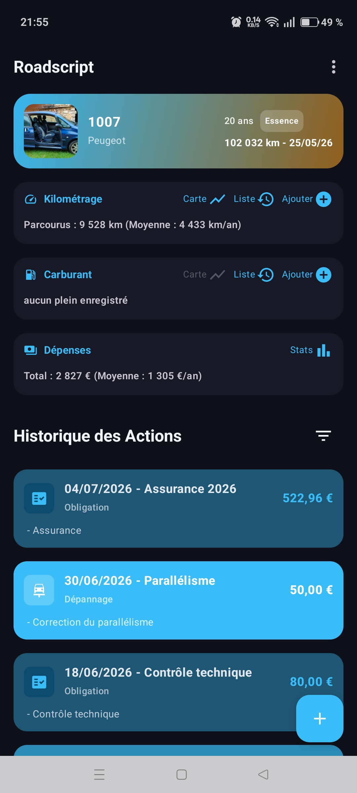
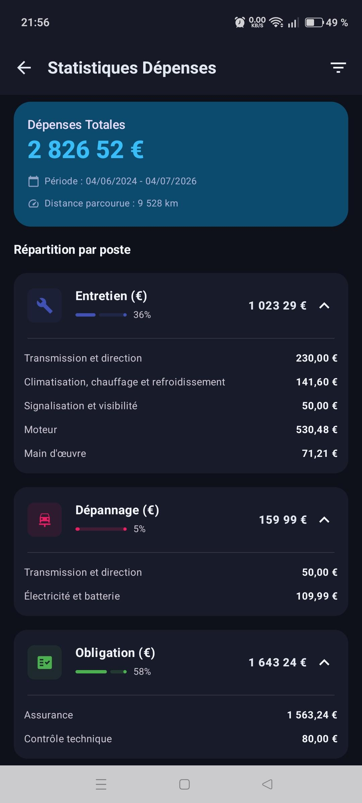
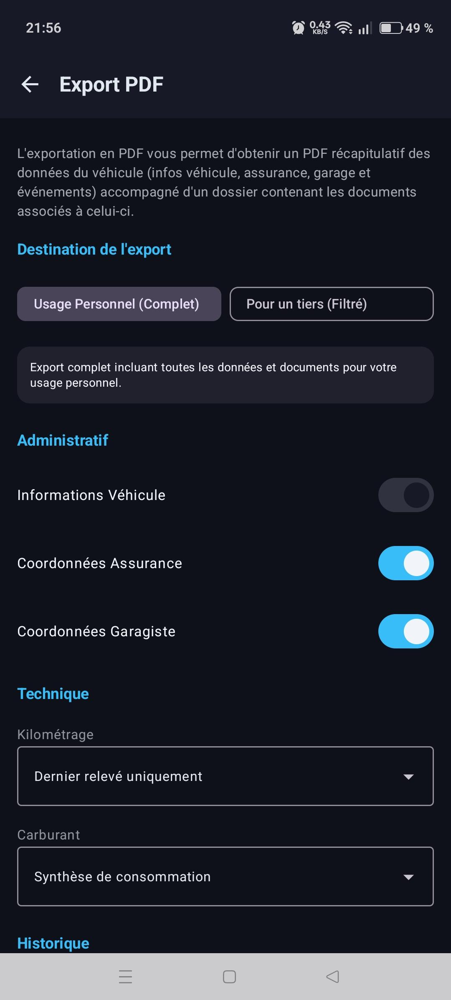
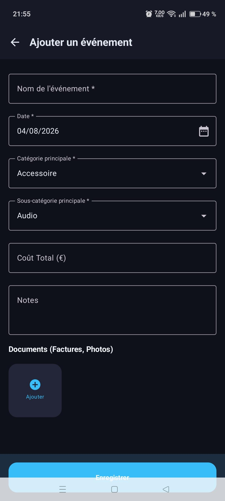
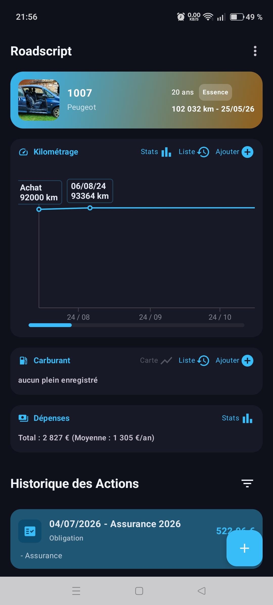
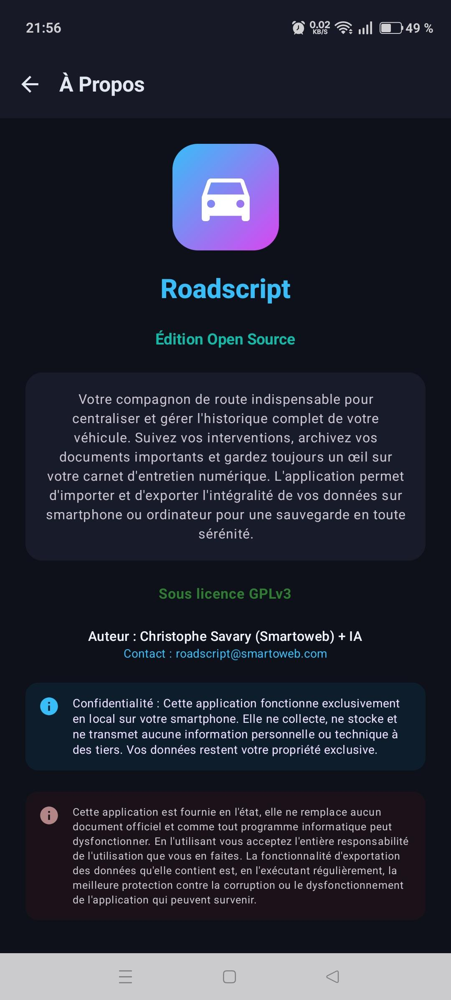

# Roadscript 🚗

**Roadscript** est votre compagnon de route indispensable pour centraliser et gérer l'historique complet de votre véhicule. Cette application Android open-source vous permet de suivre vos interventions, d'archiver vos documents importants et de garder un œil précis sur votre carnet d'entretien numérique.

---

## ✨ Fonctionnalités Clés

- 📊 **Suivi complet** : Enregistrez toutes les interventions de maintenance (vidanges, pneus, freins, etc.).
- ⛽ **Gestion du carburant** : Suivez votre consommation et vos dépenses à chaque plein.
- 📈 **Statistiques détaillées** : Visualisez l'évolution de vos dépenses et de votre kilométrage via des graphiques clairs.
- 📂 **Gestion documentaire** : Prenez en photo vos factures et documents officiels pour les lier à vos événements.
- 🌍 **Obligations locales** : L'application configure automatiquement les échéances légales (contrôle technique, taxes) en fonction de votre pays.
- 📄 **Export PDF Professionnel** : Générez un dossier complet (rapport de synthèse + documents bruts) pour la revente ou le suivi personnel.
- 🔐 **Vie privée & Sécurité** : Vos données restent exclusivement sur votre téléphone. Import/Export facile via fichier ZIP sécurisé.

---

## 📸 Aperçu

  
  
  

  
  
  

---

## 🌍 Internationalisation

### Langues Supportées 💬
Roadscript parle votre langue ! L'interface est intégralement traduite en :
- 🇫🇷 **Français**
- 🇺🇸 **Anglais** (English)
- 🇪🇸 **Espagnol** (Español)
- 🇩🇪 **Allemand** (Deutsch)
- 🇮🇹 **Italien** (Italiano)
- 🇵🇹 **Portugais** (Português)

### Pays Configurés 🗺️
L'application adapte les obligations administratives pour plus de **50 pays**, dont :
- **Europe** : France, Belgique, Suisse, Allemagne, Italie, Espagne, Portugal, Royaume-Uni, etc.
- **Amériques** : Canada, États-Unis, Mexique, Brésil, Argentine, Chili, Colombie...
- **Afrique** : Maroc, Algérie, Tunisie, Sénégal, Côte d'Ivoire...
- **Asie/Océanie** : Japon, Australie, Nouvelle-Zélande, Inde, Turquie...

---

## 🛠️ Installation & Développement

### Prérequis
- Android 8.0 (API 26) ou supérieur.
- Android Studio Ladybug (ou version plus récente).

### Compilation
1. Clonez le dépôt : `git clone https://github.com/votre-compte/Roadscript.git`
2. Ouvrez le projet dans Android Studio.
3. Synchronisez les fichiers Gradle.
4. Lancez la compilation via `./gradlew assembleRelease`.

---

## ⚖️ Licence

Ce projet est distribué sous licence **GNU GPLv3**. Vous êtes libre de l'utiliser, de le modifier et de le distribuer sous les mêmes conditions.

---

*Développé avec ❤️ par Christophe Savary (Smartoweb) & AI.*
